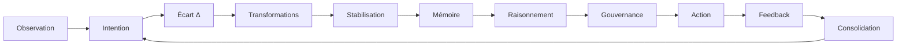

# Figure 1 — Cycle NCC-V0

```mermaid
flowchart LR
    A[Observation] --> B[Intention]
    B --> C[Écart Δ]
    C --> D[Transformations]
    D --> E[Stabilisation]
    E --> F[Mémoire]
    F --> G[Raisonnement]
    G --> H[Gouvernance]
    H --> I[Action]
    I --> J[Feedback]
    J --> K[Consolidation]
    K --> B
```
