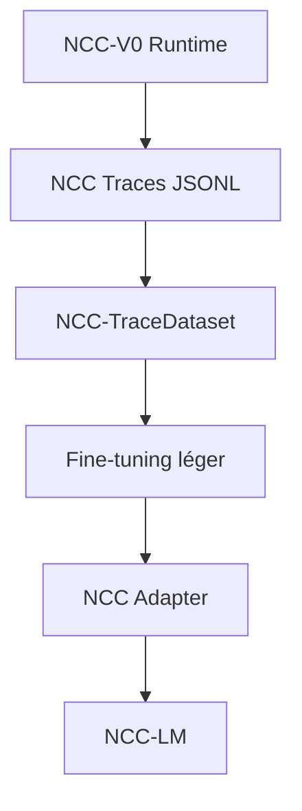

# Figure 2 — Du runtime au modèle NCC-LM

```mermaid
flowchart TD
    A[NCC-V0 Runtime] --> B[NCC Traces JSONL]
    B --> C[NCC-TraceDataset]
    C --> D[Fine-tuning léger]
    D --> E[NCC Adapter]
    E --> F[NCC-LM]
```
